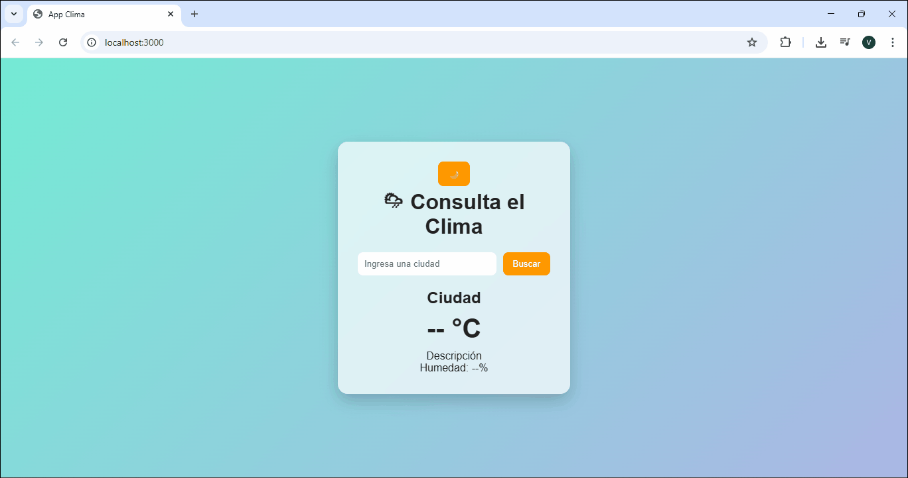
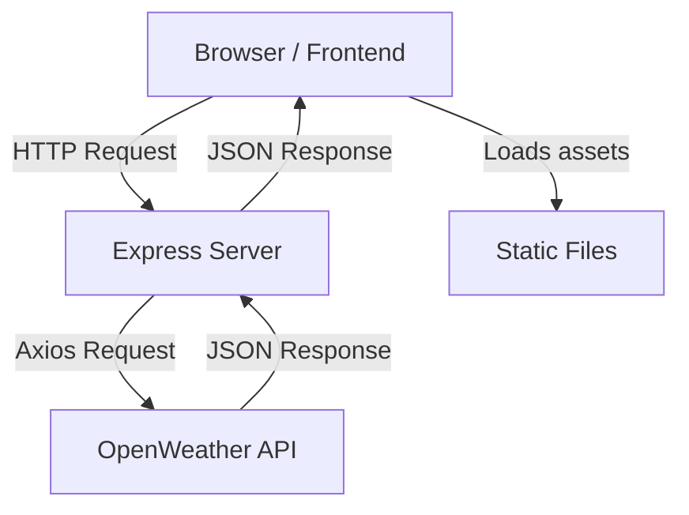

# 🌦️ Weather App – OpenWeather API


A full-stack web application that allows users to check real-time weather conditions for any city in the world using the OpenWeather API.
Built with a clean architecture separating frontend and backend, focusing on performance, security, and user experience.

---

## 🎥 Demo

<p align="center">
  
</p>

---

## 🚀 Demo Repository

🔗 https://github.com/victoriapatarroyo/OpenWeather_API

---

## ✨ Features

* 🔍 Real-time city search
* 🌡️ Current temperature display
* ☁️ Weather conditions (clouds, rain, etc.)
* 💧 Humidity
* 🏳️ Country flag display based on the searched city
* 🌙 Dark mode support
* ⚡ Fast and lightweight UI
* 🔐 API key secured using environment variables
* 🛡️ Backend proxy to protect external API calls

---

## 📊 Impact Metrics

* ⚡ **< 1s average API response time**
* 🌍 Supports **200,000+ cities worldwide**
* 🧩 **100% decoupled frontend and backend architecture**
* 🔐 Secure API consumption using `.env` (no exposed keys)
* 📦 Minimal dependencies (optimized performance)
* 🔄 Real-time DOM updates with efficient rendering

---

## 🧠 Architecture Diagram



---

## 🛠️ Technologies Used

### Frontend

* HTML5
* CSS3
* JavaScript (Vanilla JS)
* Flags API (https://flagsapi.com) – country flag rendering

### Backend

* Node.js
* Express
* Axios
* Dotenv
* Helmet (security headers)
* CORS

---

## ⚙️ Installation & Setup

Follow these steps to run the project locally:

### 1. Clone the repository

```bash
git clone https://github.com/victoriapatarroyo/OpenWeather_API.git
```

---

### 2. Navigate into the project

```bash
cd OpenWeather_API
```

---

### 3. Install dependencies

```bash
npm install
```

---

### 4. Create environment variables

Create a `.env` file **inside the `/server` folder (same level as `server.js`)**:

```
/server
  ├── server.js
  ├── .env   ✅
```

Add your API key:

```env
OPENWEATHER_API_KEY=your_api_key_here
```

Get your API key from:
https://openweathermap.org/api

---

### 5. Run the server

```bash
node server/server.js
```

Or using scripts:

```bash
npm run start
```

---

### 6. Open the app

Go to:

```
http://localhost:3000
```

---

## 📁 Project Structure

```
OpenWeather_API/
│
├── public/
│   ├── css/
│   │   └── styles.css
│   │
│   ├── js/
│   │   └── weather.js
│   │
│   ├── assets/
│   │   └── demo.gif
│   │
│   └── index.html
│
├── server/
│   ├── server.js
│   └── .env   ⚠️ (not committed)
│
├── .gitignore
├── package.json
├── package-lock.json
└── README.md
```

---

## 🔐 Security

* API keys are stored using `.env` (not exposed to the client)
* Backend acts as a secure proxy
* Content Security Policy (CSP) implemented using Helmet
* Controlled API access via Express

---

## 🚀 Future Improvements

📍 Auto-detect user location
📊 5-day weather forecast
📱 Enhanced mobile responsiveness
⚡ Performance optimization and caching

---

## 📌 Key Learnings

* REST API integration and data handling
* Third-party API consumption (OpenWeather + Flags API)
* Full-stack application structuring
* Secure API management with environment variables
* HTTP security best practices (CSP, headers)
* DOM manipulation and UI rendering
* Separation of concerns (frontend vs backend)

---

## 👩‍💻 Author

**Victoria Patarroyo**
Software Developer

🔗 GitHub: https://github.com/victoriapatarroyo

---

## 📄 License

This project is open for educational purposes and free to modify.
